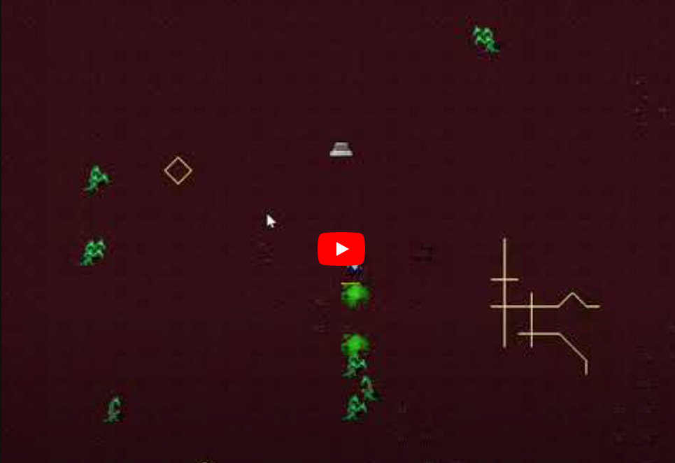

# Dungeon Crawler

# Demostracion

# Descripcion 
"Un "dungeon crawl" es un tipo de escenario en juegos de rol de fantasía 
en el que los héroes exploran un entorno de laberinto (un "calabozo"), 
luchando contra varios monstruos, evitando trampas, resolviendo acertijos y saqueando cualquier tesoro que puedan encontrar. 
Los videojuegos y juegos de mesa que presentan predominantemente elementos de "dungeon crawl" se consideran parte de este género."
En este proyecto se piensa adoptar esta idea para hacer un videojuego de vista superior influenciado por el juego "Moonlighter" del estudio "11 bit studios"

# Objetivo 
Realizar una demo jugable con la tematica de un Dungeon Crawler donde se pueda atacar a los enemigos y a la vez estos te ataquen para poder matarte

# Carpetas 
- bin/ - Contiene los ejecutables del proyecto 
- src/ - Contiene el codigo fuente 
- include/ - Los archivos de cabecera 
- assets/ - Contiene los recursos del proyecto 
- docs/ - Contiene la documentacion del archivo 

# Funcionamiento
## AdminAtaque
- Gestiona una lista de ataques en un juego. 
- La clase permite agregar nuevos ataques (NuevoAtaque), actualizar el estado de los ataques eliminando los inactivos (Actualizacion), verificar si algún ataque ha alcanzado una posición específica (CheckHit), y dibujar los ataques en una ventana (draw). 
- Además, incluye un método para eliminar todos los ataques (EliminarTodo).

## AdministradorDragon
- Define una clase AdministradorDragon que maneja una lista de dragones en un juego. 
- La clase permite agregar nuevos dragones en posiciones aleatorias (NuevoDragon y GenerarDragones), actualizar las posiciones de los dragones para que sigan a un personaje (Actualizacion), dibujar los dragones en una ventana (draw), obtener las coordenadas de todos los dragones (GetCoordenadas), eliminar un dragón específico (EliminarDragon), y verificar si existen dragones en la lista (ExistenDragones). 
- También incluye un método para generar números aleatorios (NumeroAleatorio).

## Ataque.hpp
- La clase Ataque maneja una entidad de ataque en un juego, controlando su posición, movimiento, animación y duración activa. 
- Utiliza una instancia de Imagen para representar el ataque, moviéndola desde coordenadas iniciales (x, y) a finales (fx, fy) y cambiando su imagen cada pocos pasos para simular animación. 
- También incluye métodos para dibujar el ataque en una ventana y para verificar si el ataque sigue activo basándose en un temporizador interno.

## Contador.hpp
- Define una clase Contador que utiliza sf::Clock de SFML para medir el tiempo transcurrido. 
- La clase incluye métodos para obtener el tiempo transcurrido en segundos (GetTiempo), verificar si ha pasado un cierto número de segundos y reiniciar el reloj si es así (Esperar), y reiniciar el reloj manualmente (ResetearReloj). 
- La clase reinicia el reloj al ser creada y cuando se destruye no realiza ninguna acción adicional.

## Dragon.hpp
- La clase Dragon maneja una entidad de dragón en un juego, controlando su nivel, posición y movimiento. 
- Utiliza una instancia de Imagen para representar el dragón, permitiendo actualizar su nivel y moverlo hacia unas coordenadas específicas, ajustando su imagen para simular animación. 
- Incluye métodos para incrementar o decrementar el nivel, mover el dragón siguiendo unas coordenadas dadas y dibujar el dragón en una ventana.

## Mapa.hpp 
- Define una clase Mapa que gestiona diferentes texturas de mapa en un juego. 
- La clase carga cinco texturas diferentes desde archivos al inicializarse (check), selecciona una textura aleatoriamente (MapaAlelatorio y Elegirmapa), y aplica la textura seleccionada a un sf::Sprite. La clase también permite obtener el sprite (getSprite) y dibujarlo en una ventana (draw). 
- Si alguna textura no se carga correctamente, se lanza una excepción.

## Imagen.hpp
- La clase Imagen gestiona sprites en un juego utilizando SFML. 
- Carga una textura de archivo, permite cambiar la porción visible de la textura basada en coordenadas dadas, y maneja el movimiento y posicionamiento del sprite. 
- Verifica que las coordenadas estén dentro de un rango válido y proporciona métodos para obtener el sprite, cambiar su imagen, posicionarlo y moverlo. 
- Si no se puede cargar la textura, lanza un error.

## Personaje.hpp 
- Gestiona el nivel actual de un juego. La clase tiene un miembro privado NumeroNivel que almacena el número del nivel actual e inicia en 1. 
- Incluye métodos para obtener el nivel actual (GetNivelActual) y avanzar al siguiente nivel (SiguienteNivel). 
- No realiza ninguna acción adicional al ser destruida.

## Personaje.hpp 
- La clase Personaje gestiona un personaje en un juego, combinando una forma rectangular de SFML y una imagen (Imagen). 
- Inicializa el personaje con una posición y color, y ajusta el sprite de Imagen a la misma posición. Proporciona métodos para mover el personaje, obtener su posición actual y dibujarlo en una ventana. 
- La velocidad de movimiento es configurable y la imagen del personaje se establece inicialmente a una porción específica de la textura.

# Tutorial 
- Instalar msys2
Se recomienda este Tutorial: https://code.visualstudio.com/docs/cpp/config-mingw.
- Descargar la libreria SFML en la consola de msys correspondiente
- Copiar este repositorio de github en visual studio code 
- Escribir en la terminal make runjuego
- Disfrutar 

# Agradecimiento 
- Todos los assets usados fueron traidos por: https://opengameart.org/content/dungeon-crawl-32x32-tiles-supplemental gracias a estos el proyecto pudo hacerse 

- Jose Manuel Velazquez 23110161
- Andres Flores Bañuelos 23110155